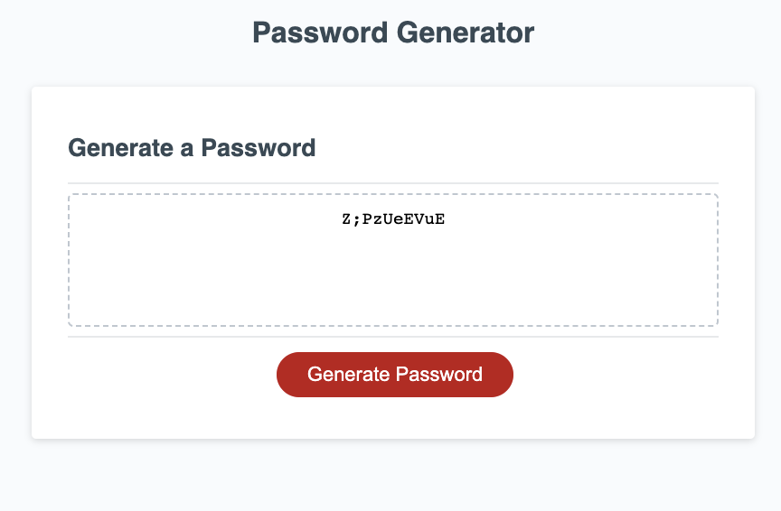

# Password-Generator
## Description
An application that can generate a password based on the criteria selected.

Below is how the application works:
* When a user clicks on the generate password button, he is presented with some prompts to select the number of characters he wants the password to be.
* If password is less than 8 or greater than 128, the user is alerted and asked to try again.
* The user is then prompted to select either uppercase, lowercase, number, or special characters as password criteria. If user doesnt select any, he is prompted to select at least one.
* When all the conditions have been met, the password appears in the textarea.

## Installation

The URL of the deployed application is: https://buky-js.github.io/Password-Generator/

You URL of the GitHub repository containing the code is: https://github.com/Buky-js/Password-Generator

## Usage
You can find the code to the application in my Github account

## Credits
N/A

## License
Please refer to MIT license used in the repo